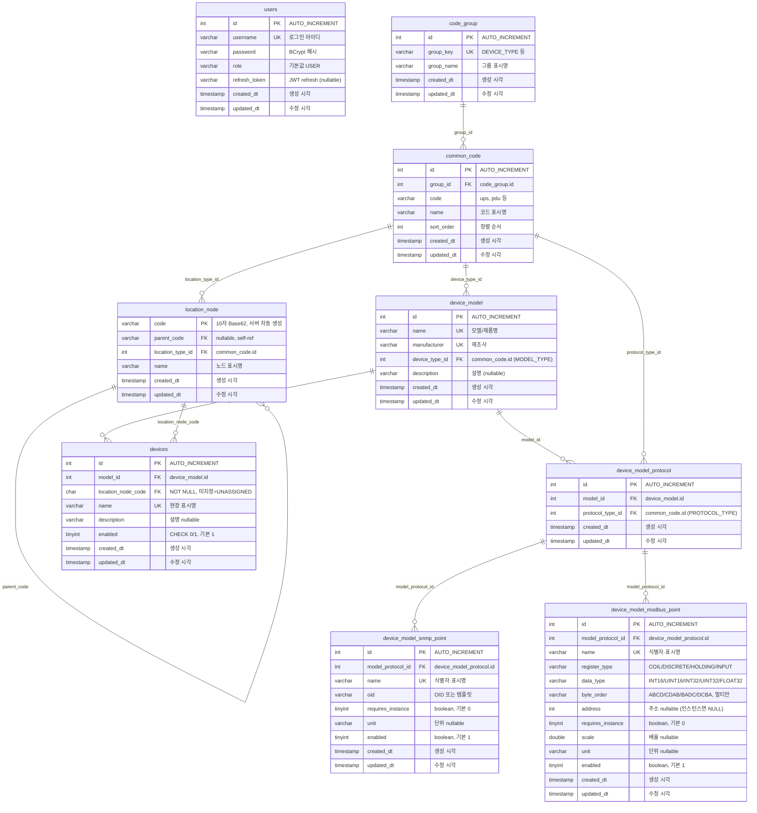
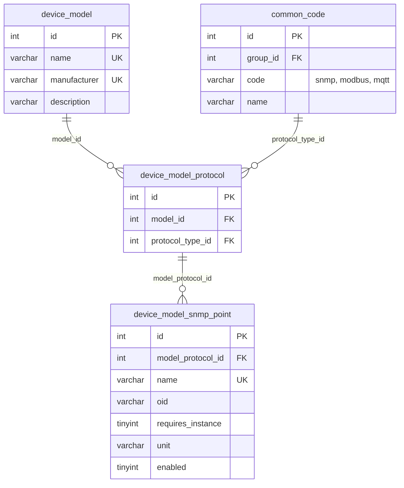
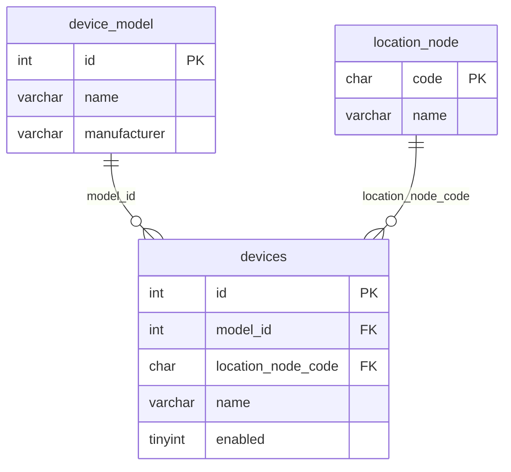
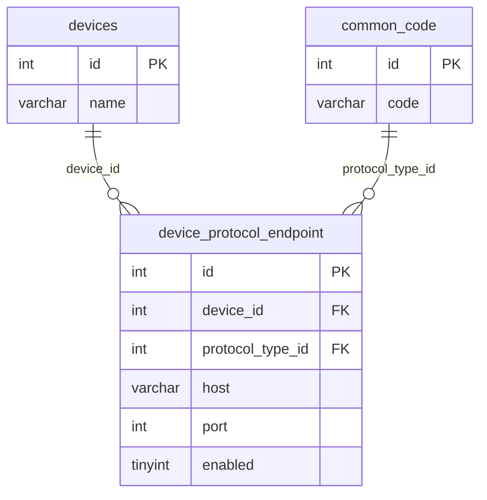

# DB ERD

`new-manager-server` 데이터베이스 스키마를 모듈 단위로 정리합니다.  
테이블·컬럼이 추가될 때마다 이 문서를 갱신합니다.

> 기준 DB: MariaDB `dcim_new` (test 프로파일)  
> 엔티티 위치: `module/{name}/domain/model`  
> 공통 컬럼: `shared/persistence/BaseEntity` (`created_dt`, `updated_dt`)

---

## 전체 관계도 (현재)



| 모듈 | 테이블 | 관계 |
|------|--------|------|
| identity | `users` | 독립 |
| common | `code_group` | 1 |
| common | `common_code` | N → `code_group` |
| location | `location_node` | N → `common_code` (LOCATION_TYPE), 자기참조 `parent_code` |
| devicemodel | `device_model` | N → `common_code` (MODEL_TYPE), UK: name+manufacturer |
| devicemodel | `device_model_protocol` | 모델 ↔ PROTOCOL_TYPE N:M (UK: model_id+protocol_type_id) |
| devicemodel | `device_model_snmp_point` | ✅ SNMP point (UK: model_protocol_id+name) |
| devicemodel | `device_model_modbus_point` | ⏳ Modbus point 카탈로그 (UK: model_protocol_id+name) |
| device | `devices` | ⏳ 장비 인스턴스 (UK: location_node_code+name, 미지정=`UNASSIGNED`) |

---

## 테이블 상세

### `users` — 사용자 (identity 모듈)

| 컬럼 | 타입 | NULL | 키 | 설명 |
|------|------|------|-----|------|
| `id` | INT | N | PK | 사용자 ID |
| `username` | VARCHAR(255) | N | UK | 로그인 아이디 |
| `password` | VARCHAR(255) | N | | BCrypt 인코딩 비밀번호 |
| `role` | VARCHAR(50) | Y | | 권한 (`USER` 등) |
| `refresh_token` | VARCHAR(512) | Y | | 리프레시 토큰 저장 |
| `created_dt` | TIMESTAMP(6) | Y | | 최초 생성 시각 |
| `updated_dt` | TIMESTAMP(6) | Y | | 최종 수정 시각 |

**엔티티:** `module/identity/domain/model/User.java`  
**상속:** `BaseEntity`  
**DDL:** [V001__create_users_table.sql](../sql/history/V001__create_users_table.sql)

**참고 (애플리케이션 규칙)**

- 신규 가입 시 `role` = `USER` (API 입력 없음, `User.createNew()`에서 고정)
- `password`는 평문 저장하지 않음 (`PasswordEncoder` 사용)
- `refresh_token`은 로그인·토큰 갱신 시 갱신

#### `role` (권한)

| 항목 | 내용 |
|------|------|
| API에서 입력? | 아니요 — `AuthRequest`는 `username`, `password`만 |
| 어디서 설정? | `User.createNew()`에서 `"USER"` 하드코딩 |
| 종류 정의 | 별도 enum 없음 (현재 `"USER"`만) |
| Spring Security | `CustomUserDetails`가 `USER` → `ROLE_USER` 변환 |

---

### `code_group` — 코드 그룹 (common 모듈)

| 컬럼 | 타입 | NULL | 키 | 설명 |
|------|------|------|-----|------|
| `id` | INT | N | PK | 코드 그룹 ID |
| `group_key` | VARCHAR(100) | N | UK | 그룹 키 (예: `DEVICE_TYPE`) |
| `group_name` | VARCHAR(255) | N | | 그룹 표시명 |
| `created_dt` | TIMESTAMP(6) | Y | | 최초 생성 시각 |
| `updated_dt` | TIMESTAMP(6) | Y | | 최종 수정 시각 |

**엔티티:** `module/common/domain/model/CodeGroup.java`  
**상속:** `BaseEntity`  
**DDL:** [V002__create_code_group_table.sql](../sql/history/V002__create_code_group_table.sql)

**예시 데이터**

| id | group_key | group_name |
|----|-----------|------------|
| 1 | DEVICE_TYPE | Device Type |
| 2 | LOCATION_TYPE | Location Type |
| 3 | ASSET_TYPE | Asset Type |
| 4 | PROTOCOL_TYPE | Protocol Type |
| 5 | ALARM_TYPE | Alarm Type |

---

### `common_code` — 공통 코드 (common 모듈)

| 컬럼 | 타입 | NULL | 키 | 설명 |
|------|------|------|-----|------|
| `id` | INT | N | PK | 공통 코드 ID |
| `group_id` | INT | N | FK | `code_group.id` |
| `code` | VARCHAR(100) | N | UK* | 코드 값 (예: `ups`, `pdu`) |
| `name` | VARCHAR(255) | N | | 코드 표시명 |
| `sort_order` | INT | Y | | 목록 정렬 순서 |
| `created_dt` | TIMESTAMP(6) | Y | | 최초 생성 시각 |
| `updated_dt` | TIMESTAMP(6) | Y | | 최종 수정 시각 |

\* UK: `(group_id, code)` 복합 유니크 — 같은 그룹 내 코드 중복 불가

**엔티티:** `module/common/domain/model/CommonCode.java`  
**상속:** `BaseEntity`  
**연관:** `@ManyToOne` → `CodeGroup` (`@JoinColumn(name = "group_id")`)  
**DDL:** [V003__create_common_code_table.sql](../sql/history/V003__create_common_code_table.sql)

**FK 제약**

| FK | 참조 | ON DELETE | ON UPDATE |
|----|------|-----------|-----------|
| `fk_common_code_group_id` | `code_group(id)` | RESTRICT | CASCADE |

**예시 데이터**

| id | group_id | code | name | sort_order |
|----|----------|------|------|------------|
| 1 | 1 | ups | UPS | 1 |
| 2 | 1 | pdu | PDU | 2 |
| 3 | 1 | sensor | Sensor | 3 |
| 4 | 2 | rack | Rack | 1 |
| 5 | 2 | row | Row | 2 |
| 6 | 3 | rack | Rack | 1 |
| 7 | 4 | snmp | SNMP | 1 |

---

### `location_node` — 위치 트리 노드 (location 모듈)

| 컬럼 | 타입 | NULL | 키 | 설명 |
|------|------|------|-----|------|
| `code` | CHAR(10) | N | PK | 노드 식별자 (**10자 Base62**, 서버 자동 생성, 불변) |
| `parent_code` | CHAR(10) | Y | FK | 부모 노드 code. **루트는 NULL** |
| `location_type_id` | INT | N | FK | 위치 유형 (`common_code.id`, **LOCATION_TYPE만 허용**) |
| `name` | VARCHAR(255) | N | UK* | 노드 표시명 (사용자 입력) |
| `created_dt` | TIMESTAMP(6) | Y | | 최초 생성 시각 |
| `updated_dt` | TIMESTAMP(6) | Y | | 최종 수정 시각 |

\* UK: `(parent_code, name)` — 자식 노드 이름 중복 방지. 루트는 애플리케이션에서 검증

**엔티티:** `module/location/domain/model/LocationNode.java`  
**API 설계:** [LOCATION_NODE_API.md](../location/LOCATION_NODE_API.md)  
**상속:** `BaseEntity`  
**연관:**
- `@ManyToOne` → `LocationNode` (`@JoinColumn(name = "parent_code")`) — 자기 참조
- `@ManyToOne` → `CommonCode` (`@JoinColumn(name = "location_type_id")`)

**DDL:** [V004__create_location_node_table.sql](../sql/history/V004__create_location_node_table.sql)

**FK 제약**

| FK | 참조 | ON DELETE | ON UPDATE |
|----|------|-----------|-----------|
| `fk_location_node_parent_code` | `location_node(code)` | RESTRICT | CASCADE |
| `fk_location_node_location_type_id` | `common_code(id)` | RESTRICT | CASCADE |

**향후 연동 (devices)**

| 컬럼 | 설명 |
|------|------|
| `devices.location_node_code` | 장비 위치 FK → `location_node(code)` (**NOT NULL**. 미지정 시 시드 노드 `UNASSIGNED`) |

> API·DDL: [DEVICE_API.md](device/DEVICE_API.md), [V007__create_devices_table.sql](../sql/history/V007__create_devices_table.sql)

**트리 규칙 (애플리케이션)**

| 구분 | 조건 |
|------|------|
| 루트 노드 | `parent_code IS NULL` |
| 리프 노드 | `parent_code = 이 노드 code` 인 행이 없음 |
| 위치 유형 | `location_type_id` → `common_code` 중 `group_key = 'LOCATION_TYPE'`만 허용 (DB FK는 `common_code`만 검증) |
| `code` | 일반: 생성 시 10자 Base62. **시스템: `UNASSIGNED` 고정 시드** |
| `UNASSIGNED` | 삭제·이름 변경 금지. 장비 선등록 시 임시 위치 |
| 순환 참조 | 금지 (애플리케이션 검증) |
| 자식 있는 노드 삭제 | 리프만 단건 삭제 / 서브트리 cascade 삭제 API로 분리 ([API 설계](../location/LOCATION_NODE_API.md#5-삭제-api)) |
| 유형 삽입 시 재구성 | 중간 유형 등록 시 기존 직접 자식 재부모화 ([API 설계](../location/LOCATION_NODE_API.md#자식-등록-시-트리-재구성-핵심-규칙)) |

**시드 데이터 (V004)**

`LOCATION_TYPE`: `UNASSIGNED`, `CONTAINER`, `ZONE`, `ROW`, `RACK`  
`location_node`: `code=UNASSIGNED`, `name=미배정`, `parent_code=NULL`

| code | parent_code | location_type_id | name |
|------|-------------|------------------|------|
| `K7mN2pQx9L` | NULL | 1 | 컨테이너 A |
| `A1b2C3d4E5` | `K7mN2pQx9L` | 2 | Zone 1 |
| `Z9y8X7w6V5` | `A1b2C3d4E5` | 3 | A열 |
| `M4n3B2v1C0` | `Z9y8X7w6V5` | 4 | Rack-01 |

> `location_type_id`는 `common_code.id` (LOCATION_TYPE 그룹)를 가리킵니다.

---

### `device_model` — 장비 제품 모델 (devicemodel 모듈)

**구현 상태:** ✅ 구현 완료

| 컬럼 | 타입 | NULL | 키 | 설명 |
|------|------|------|-----|------|
| `id` | INT | N | PK | 모델 ID (AUTO_INCREMENT) |
| `name` | VARCHAR(255) | N | UK | 모델/제품명 |
| `manufacturer` | VARCHAR(255) | N | UK | 제조사 |
| `device_type_id` | INT | N | FK | `common_code.id` (**MODEL_TYPE**만) |
| `description` | VARCHAR(1000) | Y | | 설명 |
| `created_dt` | TIMESTAMP(6) | Y | | 최초 생성 시각 |
| `updated_dt` | TIMESTAMP(6) | Y | | 최종 수정 시각 |

\* UK: `(name, manufacturer)`  
\* 장비 유형은 모델에만 두고, `devices`에는 type FK를 두지 않음. 컬럼명은 `device_type_id`, 그룹 키는 `MODEL_TYPE`.

**엔티티:** `module/devicemodel/domain/model/DeviceModel.java`  
**API 설계:** [DEVICE_MODEL_API.md](devicemodel/DEVICE_MODEL_API.md)  
**상속:** `BaseEntity`  
**연관:** `@ManyToOne` → `CommonCode` (`device_type_id`), `@OneToMany` → `DeviceModelProtocol` (`mappedBy = "deviceModel"`, cascade ALL)

**DDL:** [V005__create_device_model_tables.sql](../sql/history/V005__create_device_model_tables.sql) (신규)  
**마이그레이션:** [V008__add_device_model_device_type_id.sql](../sql/history/V008__add_device_model_device_type_id.sql) (이미 `device_model`이 있는 DB)

| 제약 | 대상 | ON DELETE | ON UPDATE |
|------|------|-----------|-----------|
| `fk_device_model_device_type_id` | `common_code(id)` | RESTRICT | CASCADE |

**범위**

| 참조 주체 | model FK |
|-----------|----------|
| `devices` (향후) | ✅ |
| `assets` (향후, 장비류) | ✅ 검토 |
| `location_node` | ❌ |

---

### `device_model_protocol` — 모델별 프로토콜 (devicemodel 모듈)

**구현 상태:** ✅ 구현 완료

| 컬럼 | 타입 | NULL | 키 | 설명 |
|------|------|------|-----|------|
| `id` | INT | N | PK | 연결 ID |
| `model_id` | INT | N | FK | `device_model.id` |
| `protocol_type_id` | INT | N | FK | `common_code.id` (**PROTOCOL_TYPE**만) |
| `created_dt` | TIMESTAMP(6) | Y | | |
| `updated_dt` | TIMESTAMP(6) | Y | | |

| 제약 | 규칙 |
|------|------|
| UK | `(model_id, protocol_type_id)` |

**엔티티:** `module/devicemodel/domain/model/DeviceModelProtocol.java`  
**연관:**
- `@ManyToOne` → `DeviceModel` (`model_id`)
- `@ManyToOne` → `CommonCode` (`protocol_type_id`)

**FK 제약**

| FK | 참조 | ON DELETE | ON UPDATE |
|----|------|-----------|-----------|
| `fk_device_model_protocol_model_id` | `device_model(id)` | RESTRICT | CASCADE |
| `fk_device_model_protocol_protocol_type_id` | `common_code(id)` | RESTRICT | CASCADE |

**관계 (N:M)**

```
device_model ←—— device_model_protocol ——→ common_code (PROTOCOL_TYPE)
```

**PROTOCOL_TYPE 시드 (V005)**

V005에서 `code_group` + `common_code` 모두 INSERT (없을 때만).

| group_key | code | name | sort_order |
|-----------|------|------|------------|
| PROTOCOL_TYPE | snmp | SNMP | 1 |
| PROTOCOL_TYPE | modbus | Modbus | 2 |
| PROTOCOL_TYPE | mqtt | MQTT | 3 |

> ERD §code_group 예시(id=4 등)는 문서용. 실제 id는 DB마다 다름.

---

### `device_model_snmp_point` — 모델별 SNMP 수집 point (devicemodel 모듈)

**구현 상태:** ✅ 구현 완료

| 컬럼 | 타입 | NULL | 키 | 기본값 | 설명 |
|------|------|------|-----|--------|------|
| `id` | INT | N | PK | AUTO_INCREMENT | point ID |
| `model_protocol_id` | INT | N | FK | | `device_model_protocol.id` (SNMP만) |
| `name` | VARCHAR(255) | N | UK* | | 식별자·표시명 (`V`, `전압`, `PRI-FLOW`) |
| `oid` | VARCHAR(512) | N | | | OID 또는 `{instanceId}` 템플릿 |
| `requires_instance` | TINYINT(1) | N | | `0` | OID `{instanceId}` 치환 필요 여부 (boolean) |
| `unit` | VARCHAR(50) | Y | | | 단위 (`V`, `A`, `L/min`) |
| `enabled` | TINYINT(1) | N | | `1` | 사용 여부 (boolean) |
| `created_dt` | TIMESTAMP(6) | Y | | | |
| `updated_dt` | TIMESTAMP(6) | Y | | | |

\* UK: `(model_protocol_id, name)` — 같은 SNMP protocol 연결 안에서만 name 유일. **모델 간 `V` 중복은 허용**

**엔티티:** `module/devicemodel/domain/model/DeviceModelSnmpPoint.java`  
**API 설계:** [DEVICE_MODEL_SNMP_POINT_API.md](devicemodel/DEVICE_MODEL_SNMP_POINT_API.md)  
**상속:** `BaseEntity`  
**연관:** `@ManyToOne` → `DeviceModelProtocol` (`model_protocol_id`, LAZY)

**DDL:** [V006__create_device_model_snmp_point.sql](../sql/history/V006__create_device_model_snmp_point.sql)

**FK 제약**

| FK | 참조 | ON DELETE | ON UPDATE |
|----|------|-----------|-----------|
| `fk_device_model_snmp_point_model_protocol_id` | `device_model_protocol(id)` | CASCADE | CASCADE |

**관계도 (devicemodel — SNMP point)**



```
device_model (1) ──< device_model_protocol (N) >── common_code (PROTOCOL_TYPE)
                            │
                            └──< device_model_snmp_point (N)   ※ protocolCode = snmp 만
```

| 제약 | 규칙 |
|------|------|
| UK | `(model_protocol_id, name)` |
| 프로토콜 | `protocolCode = snmp` 인 `device_model_protocol`만 point 등록 가능 |
| 삭제 | protocol 삭제 시 point CASCADE |

---

### `devices` — 장비 인스턴스 (device 모듈, 1차)

**구현 상태:** ✅ 구현됨

> 4층 아키텍처 **② 인스턴스층** — host/port·프로토콜 설정은 V009 `device_protocol_endpoint`에서 분리.  
> 설계: [DEVICE_ARCHITECTURE.md](device/DEVICE_ARCHITECTURE.md) · [DEVICE_API.md](device/DEVICE_API.md)  
> 위치 미지정: V004 시드 노드 **`UNASSIGNED`** 참조 (NULL 아님)

| 컬럼 | 타입 | NULL | 키 | 기본값 | 설명 |
|------|------|------|-----|--------|------|
| `id` | INT | N | PK | AUTO_INCREMENT | 장비 ID (API·Influx `device_id`) |
| `model_id` | INT | N | FK | | `device_model.id` |
| `location_node_code` | CHAR(10) | N | FK, UK | | `location_node.code` (미지정=`UNASSIGNED`) |
| `path_code_id` | INT | Y | FK | | `common_code.id` (`LOCATION_PATH`, PDU Path) |
| `name` | VARCHAR(255) | N | UK | | 현장 표시명 |
| `description` | VARCHAR(1000) | Y | | | 설명 |
| `enabled` | TINYINT(1) | N | | `1` | 사용 여부 (CHECK 0/1) |
| `created_dt` | TIMESTAMP(6) | Y | | | |
| `updated_dt` | TIMESTAMP(6) | Y | | | |

**UK:** `(location_node_code, name)` — 같은 위치 아래 표시명 중복 불가

**엔티티:** `module/device/domain/model/Device.java` ✅  
**API 설계:** [DEVICE_API.md](device/DEVICE_API.md)  
**상속:** `BaseEntity`  
**연관:**
- `@ManyToOne` → `DeviceModel` (`model_id`)
- `@ManyToOne` → `LocationNode` (`location_node_code`, required)
- `@ManyToOne` → `CommonCode` (`path_code_id`, optional, `LOCATION_PATH`)

**DDL:** [V007__create_devices_table.sql](../sql/history/V007__create_devices_table.sql), [V019__device_path_code.sql](../sql/history/V019__device_path_code.sql)

**FK 제약**

| FK | 참조 | ON DELETE | ON UPDATE |
|----|------|-----------|-----------|
| `fk_devices_model_id` | `device_model(id)` | RESTRICT | CASCADE |
| `fk_devices_location_node_code` | `location_node(code)` | RESTRICT | CASCADE |
| `fk_devices_path_code_id` | `common_code(id)` | RESTRICT | CASCADE |

**관계도**



---

### `device_protocol_endpoint` — 프로토콜 엔드포인트 (공통 전송층)

**구현 상태:** ✅ 구현됨 (공통 테이블 + SNMP instance V011. Modbus device 확장 제외)

> 4층 아키텍처 **③ 엔드포인트층** — host/port.  
> API: [DEVICE_ENDPOINT_API.md](device/DEVICE_ENDPOINT_API.md)  
> DDL: [V009__create_device_protocol_endpoint.sql](../sql/history/V009__create_device_protocol_endpoint.sql)

| 컬럼 | 타입 | NULL | 키 | 기본값 | 설명 |
|------|------|------|-----|--------|------|
| `id` | INT | N | PK | AUTO_INCREMENT | 엔드포인트 ID |
| `device_id` | INT | N | FK, UK | | `devices.id` |
| `protocol_type_id` | INT | N | FK, UK | | `common_code.id` (`PROTOCOL_TYPE`) |
| `host` | VARCHAR(255) | N | | | IP 또는 hostname |
| `port` | INT | N | | | 포트 (CHECK 1~65535) |
| `enabled` | TINYINT(1) | N | | `1` | 사용 여부 |
| `created_dt` | TIMESTAMP(6) | Y | | | |
| `updated_dt` | TIMESTAMP(6) | Y | | | |

**UK:** `(device_id, protocol_type_id)` — 장비당 프로토콜 1엔드포인트

**엔티티:** `module/device/domain/model/DeviceProtocolEndpoint.java` ✅  
**상속:** `BaseEntity`  
**연관:**
- `@ManyToOne` → `Device` (`device_id`)
- `@ManyToOne` → `CommonCode` (`protocol_type_id`)

**FK 제약**

| FK | 참조 | ON DELETE | ON UPDATE |
|----|------|-----------|-----------|
| `fk_device_protocol_endpoint_device_id` | `devices(id)` | CASCADE | CASCADE |
| `fk_device_protocol_endpoint_protocol_type_id` | `common_code(id)` | RESTRICT | CASCADE |

**관계도**



**이후 (본 테이블에 넣지 않음)**

| 테이블 | 역할 | 상태 |
|--------|------|------|
| `device_snmp_instance` | `{instanceId}` 치환 (PDU형) | ✅ V011 |
| `page_widget` (+ point/device/layout) | 페이지 위젯 조회·장비·2D 배치 | ✅ V018 — [PAGE_WIDGET_API.md](./device/PAGE_WIDGET_API.md) |
| ~~`device_page`~~ | (삭제, V018) | ❌ |
| `device_snmp_point` | SRC형 장비별 전체 OID | ⬜ — [BACKLOG](./BACKLOG.md) |
| `device_endpoint_modbus` | unit_id, timeout_ms | ⬜ |
| community / version | 앱 기본값. DB 의도적 제외 | 보류 |
| `devices.parent_device_id` | 장비 계층 | ⬜ (V011 아님) |

---

## boolean 컬럼 규칙 (프로젝트 공통)

플래그성 컬럼은 **`boolean` (`true` / `false`)** 을 사용합니다.  
**`device_model_snmp_point`가 최초** 적용 대상이며, 이후 Modbus/MQTT point·device 설정 등에도 동일 규칙을 적용합니다.

| 계층 | 규칙 | 예시 |
|------|------|------|
| DB | `TINYINT(1) NOT NULL DEFAULT 0` (또는 `1`) | `requires_instance`, `enabled` |
| Java | `boolean` + `@Column(nullable = false)` | `requiresInstance`, `enabled` |
| API JSON | `true` / `false` | `requiresInstance`, `enabled` |

| 컬럼 (DB) | API 필드 | 기본값 | 의미 |
|-----------|----------|--------|------|
| `requires_instance` | `requiresInstance` | `false` | OID 그대로 사용 (치환 불필요). **instanceId 값을 저장하지 않음** |
| `requires_instance` | `requiresInstance` | `true` | OID의 `{instanceId}`를 장비 `instanceId`로 치환 |
| `enabled` | `enabled` | `true` | 수집·스크립트 생성 대상 |

---

## 컬럼 ↔ 엔티티 매핑

### identity — `User`

| DB 컬럼 | Java 필드 | 출처 |
|---------|-----------|------|
| `id` | `id` | `User` |
| `username` | `username` | `User` |
| `password` | `password` | `User` |
| `role` | `role` | `User` |
| `refresh_token` | `refreshToken` | `User` |
| `created_dt` | `createdDt` | `BaseEntity` |
| `updated_dt` | `updatedDt` | `BaseEntity` |

### common — `CodeGroup`

| DB 컬럼 | Java 필드 | 출처 |
|---------|-----------|------|
| `id` | `id` | `CodeGroup` |
| `group_key` | `groupKey` | `CodeGroup` |
| `group_name` | `groupName` | `CodeGroup` |
| `created_dt` | `createdDt` | `BaseEntity` |
| `updated_dt` | `updatedDt` | `BaseEntity` |

### common — `CommonCode`

| DB 컬럼 | Java 필드 | 출처 |
|---------|-----------|------|
| `id` | `id` | `CommonCode` |
| `group_id` | `codeGroup` | `CommonCode` (`@ManyToOne`) |
| `code` | `code` | `CommonCode` |
| `name` | `name` | `CommonCode` |
| `sort_order` | `sortOrder` | `CommonCode` |
| `created_dt` | `createdDt` | `BaseEntity` |
| `updated_dt` | `updatedDt` | `BaseEntity` |

### location — `LocationNode`

| DB 컬럼 | Java 필드 | 출처 |
|---------|-----------|------|
| `code` | `code` | `LocationNode` (`@Id`) |
| `parent_code` | `parent` | `LocationNode` (`@ManyToOne`, self) |
| `location_type_id` | `locationType` | `LocationNode` (`@ManyToOne` → `CommonCode`) |
| `name` | `name` | `LocationNode` |
| `created_dt` | `createdDt` | `BaseEntity` |
| `updated_dt` | `updatedDt` | `BaseEntity` |

### devicemodel — `DeviceModel`

| DB 컬럼 | Java 필드 | 출처 |
|---------|-----------|------|
| `id` | `id` | `DeviceModel` |
| `name` | `name` | `DeviceModel` |
| `manufacturer` | `manufacturer` | `DeviceModel` |
| `description` | `description` | `DeviceModel` |
| `created_dt` | `createdDt` | `BaseEntity` |
| `updated_dt` | `updatedDt` | `BaseEntity` |

### devicemodel — `DeviceModelProtocol`

| DB 컬럼 | Java 필드 | 출처 |
|---------|-----------|------|
| `id` | `id` | `DeviceModelProtocol` |
| `model_id` | `deviceModel` | `DeviceModelProtocol` (`@ManyToOne`) |
| `protocol_type_id` | `protocolType` | `DeviceModelProtocol` (`@ManyToOne` → `CommonCode`) |
| `created_dt` | `createdDt` | `BaseEntity` |
| `updated_dt` | `updatedDt` | `BaseEntity` |

### devicemodel — `DeviceModelSnmpPoint`

| DB 컬럼 | Java 필드 | 출처 |
|---------|-----------|------|
| `id` | `id` | `DeviceModelSnmpPoint` |
| `model_protocol_id` | `modelProtocol` | `DeviceModelSnmpPoint` (`@ManyToOne`) |
| `name` | `name` | `DeviceModelSnmpPoint` |
| `oid` | `oid` | `DeviceModelSnmpPoint` |
| `requires_instance` | `requiresInstance` | `DeviceModelSnmpPoint` (`boolean`) |
| `unit` | `unit` | `DeviceModelSnmpPoint` |
| `enabled` | `enabled` | `DeviceModelSnmpPoint` (`boolean`) |
| `created_dt` | `createdDt` | `BaseEntity` |
| `updated_dt` | `updatedDt` | `BaseEntity` |

### device — `Device`

| DB 컬럼 | Java 필드 | 출처 |
|---------|-----------|------|
| `id` | `id` | `Device` |
| `model_id` | `deviceModel` | `Device` (`@ManyToOne`) |
| `location_node_code` | `locationNode` | `Device` (`@ManyToOne`, required) |
| `name` | `name` | `Device` |
| `description` | `description` | `Device` |
| `enabled` | `enabled` | `Device` (`boolean`) |
| `created_dt` | `createdDt` | `BaseEntity` |
| `updated_dt` | `updatedDt` | `BaseEntity` |

Spring Boot 기본 naming strategy 기준으로 camelCase → snake_case 변환됩니다.
