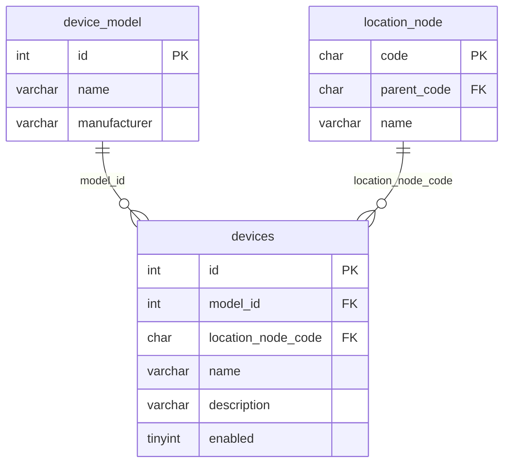

# Device API 설계

`device` 모듈의 **실제 장비 인스턴스**(`devices`) API·비즈니스 규칙을 정리한 문서입니다.

> API prefix: `/api/manager/devices`  
> 아키텍처: [DEVICE_ARCHITECTURE.md](./DEVICE_ARCHITECTURE.md)  
> 관련 ERD: [ERD.md — devices](../ERD.md#devices--장비-인스턴스-device-모듈)  
> DDL: [V007__create_devices_table.sql](../../sql/history/V007__create_devices_table.sql)

---

## 1. 개요

| 개념 | 설명 |
|------|------|
| **DeviceModel** | 장비 **제품 모델** (SKU/제품군). [DEVICE_MODEL_API.md](../devicemodel/DEVICE_MODEL_API.md) |
| **Device** | 현장에 설치된 **장비 인스턴스** 1대. 모델·위치·표시명 보유 |
| **LocationNode** | 장비가 속한 **위치** (CONTAINER / ZONE / ROW / RACK 등). [LOCATION_NODE_API.md](../location/LOCATION_NODE_API.md) |

모델 카탈로그(`device_model`, SNMP point 등)와 장비 인스턴스(`devices`)는 역할이 다릅니다.

| 층 | 테이블 | 예시 |
|----|--------|------|
| **모델 카탈로그** | `device_model`, `device_model_snmp_point` | "이 PDU 모델은 전압 OID가 …" |
| **장비 인스턴스** | `devices` (본 문서) | "1층 Rack-01의 PDU #1" |

### 1.1 1차 범위 (본 문서)

**`devices` 본체 CRUD만** 정의합니다.

| 포함 | 미포함 (다음 단계) |
|------|-------------------|
| 모델 참조 (`model_id`) | `device_snmp_config` (ip, port, instanceId, community) |
| 위치 참조 (`location_node_code`) | Modbus / MQTT 설정 테이블 |
| 표시명·설명·사용 여부 | 장비 **계층** (`parent_device_id`, children API) |
| 목록·단건·등록·수정·삭제 | Excel import, PDU 전용 API |
| | 스크립트 export, 수집 연동 |

1차는 **플랫 장비**만 다룹니다. 위치는 `location_node` FK(**필수**, 미지정=`UNASSIGNED`)로 표현하고, 부모-자식 장비 관계는 넣지 않습니다.

### 1.2 공통 제약

| 항목 | 규칙 |
|------|------|
| `modelId` | 필수. 존재하는 `device_model.id` |
| `locationNodeCode` | 필수. 존재하는 `location_node.code`. **미지정 시 `UNASSIGNED`** (장비 선등록 → 나중에 실제 위치로 수정) |
| `name` | 필수. **같은 위치**(`location_node_code`) 아래에서 중복 불가 |
| `enabled` | boolean. 기본 `true` |
| `description` | 선택 |
| 응답 `locationNodeName` | `location_node.name` (code는 응답에 포함하지 않음) |
| 모델 삭제 | `devices.model_id` 참조 중이면 409 ([DEVICE_MODEL_API](../devicemodel/DEVICE_MODEL_API.md)) |
| 위치 삭제 | 참조 device는 **`UNASSIGNED`로 자동 이동** 후 삭제. 이름 충돌 시 409. **`UNASSIGNED`는 삭제 금지** |

### 1.3 DeviceModel / LocationNode 와의 관계

```
device_model (1) ──< devices (N)
location_node (1) ──< devices (N)   ※ location_node_code NOT NULL
```

- 장비는 **반드시** 하나의 모델·하나의 위치를 참조합니다.
- 위치를 아직 모를 때는 V004 시드 노드 **`UNASSIGNED`(미배정)** 를 넣고, 수정 API로 Rack/Zone 등에 붙입니다.
- CONTAINER·ROW·RACK 등 **유형 제한 없음** ([LOCATION_NODE_API §1.2](../location/LOCATION_NODE_API.md#12-향후-devices-연동)).

### 1.4 연동 (2차 이후)

| 테이블 | 용도 | 상태 |
|--------|------|------|
| `device_protocol_endpoint` | host, port (프로토콜 공통) | ✅ [DEVICE_ENDPOINT_API](./DEVICE_ENDPOINT_API.md) |
| `device_snmp_instance` | SNMP `{instanceId}` 치환 (endpoint 1:1) | ⬜ [DEVICE_SNMP_INSTANCE_API](./DEVICE_SNMP_INSTANCE_API.md) |
| `device_endpoint_modbus` | unit_id, timeout_ms | ⬜ 예정 |
| `devices.parent_device_id` | 장비 계층 (자기참조) | ⬜ 예정 |

SNMP point OID 템플릿 + 장비 설정 합성은 [DEVICE_MODEL_SNMP_POINT_API §9](../devicemodel/DEVICE_MODEL_SNMP_POINT_API.md#9-스크립트-생성-향후) 참고.

---

## 2. 테이블 — `devices`

**구현 상태:** ✅ 구현됨

| 컬럼 | 타입 | NULL | 키 | 기본값 | 설명 |
|------|------|------|-----|--------|------|
| `id` | INT | N | PK | AUTO_INCREMENT | 장비 ID (API·Influx `device_id`) |
| `model_id` | INT | N | FK | | `device_model.id` |
| `location_node_code` | CHAR(10) | N | FK, UK | | `location_node.code` (미지정 시 `UNASSIGNED`) |
| `name` | VARCHAR(255) | N | UK | | 현장 표시명 |
| `description` | VARCHAR(1000) | Y | | | 설명 |
| `enabled` | TINYINT(1) | N | | `1` | 사용 여부 (boolean, CHECK 0/1) |
| `created_dt` | TIMESTAMP(6) | Y | | | |
| `updated_dt` | TIMESTAMP(6) | Y | | | |

**UK:** `(location_node_code, name)` — 같은 위치 아래 표시명 중복 불가.

**인덱스:** `(model_id, enabled)`, `(location_node_code, enabled)` — 목록·capabilities 조회용.

**의도적으로 없는 컬럼:** `attributes` JSON, `protocol`, `model_name`, `ip`/`port`, `parent_device_id`, `location_node_code_key` ([DEVICE_ARCHITECTURE §2](./DEVICE_ARCHITECTURE.md))

**FK 제약**

| FK | 참조 | ON DELETE | ON UPDATE |
|----|------|-----------|-----------|
| `fk_devices_model_id` | `device_model(id)` | RESTRICT | CASCADE |
| `fk_devices_location_node_code` | `location_node(code)` | RESTRICT | CASCADE |

**관계도**



---

## 3. 등록 API

### 3.1 등록 — `POST /api/manager/devices`

**구현 상태:** ✅ 구현됨

#### 요청

```json
{
  "modelId": 1,
  "locationNodeCode": "UNASSIGNED",
  "name": "PDU-01",
  "description": "Rack-01 좌측 PDU (위치는 나중에 지정)",
  "enabled": true
}
```

| 필드 | 필수 | 타입 | 설명 |
|------|------|------|------|
| `modelId` | O | integer | `device_model.id` |
| `locationNodeCode` | O | string | `location_node.code` (10자). 미지정 시 **`UNASSIGNED`** |
| `name` | O | string | 현장 표시명 |
| `description` | X | string | 설명 |
| `enabled` | X | boolean | 기본 `true` |

#### 응답 — `200 OK` (ApiResponse)

```json
{
  "success": true,
  "data": {
    "id": 101,
    "modelId": 1,
    "modelName": "APC-8941",
    "manufacturer": "APC",
    "locationNodeName": "Rack-01",
    "name": "PDU-01",
    "description": "Rack-01 좌측 PDU",
    "enabled": true
  }
}
```

#### 오류

| 조건 | HTTP | 메시지(예) |
|------|------|------------|
| 모델 없음 | 404 | `DeviceModel not found: {modelId}` |
| 위치 없음 | 404 | `LocationNode not found: {code}` |
| 같은 위치에 name 중복 | 400 | `device name already exists at this location` |
| name 빈 값 | 400 | `name is required` |

---

## 4. 수정 API

### 4.1 수정 — `PUT /api/manager/devices/{id}`

**구현 상태:** ✅ 구현됨

요청 body는 등록과 동일. **전체 교체** (부분 수정 없음).

#### 오류

등록 오류 + 아래 추가:

| 조건 | HTTP | 메시지(예) |
|------|------|------------|
| 장비 없음 | 404 | `Device not found: {id}` |
| name 중복 (자기 제외) | 400 | `device name already exists at this location` |
| `modelId` 변경 + 기존 endpoint가 새 모델 프로토콜에 없음 | 409 | `device has endpoints not supported by new model: snmp` |

`modelId`가 바뀔 때만 endpoint 정합성을 검사합니다. endpoint가 없거나, 새 모델이 기존 endpoint 프로토콜을 모두 지원하면 변경이 허용됩니다. 충돌 시 endpoint·snmp_instance를 자동 삭제하지 않습니다 — endpoint를 먼저 삭제한 뒤 모델을 변경하세요.

---

## 5. 조회 API

### 5.1 목록 — `GET /api/manager/devices`

**구현 상태:** ✅ 구현됨

#### 쿼리 파라미터

| 파라미터 | 설명 |
|----------|------|
| `modelId` | 모델 ID 일치 |
| `locationNodeCode` | 위치 code 일치 (내부 필터) |
| `name` | 표시명 부분 일치 |
| `enabled` | `true` / `false` |
| `pageCode` | 노출 페이지 code (`DEVICE_PAGE`, 예: `ENVIRONMENT`) — [DEVICE_PAGE_API](./DEVICE_PAGE_API.md) |
| `page` | 페이지 번호 (**1부터**, 기본 `1`) |
| `size` | 페이지 크기 (기본 `20`, 최대 `100`) |

정렬: `id` 오름차순.

#### 응답 — `200 OK`

```json
{
  "success": true,
  "data": {
    "content": [
      {
        "id": 101,
        "modelId": 1,
        "modelName": "APC-8941",
        "manufacturer": "APC",
        "locationNodeName": "Rack-01",
        "name": "PDU-01",
        "description": "Rack-01 좌측 PDU",
        "enabled": true
      }
    ],
    "page": 1,
    "size": 20,
    "totalElements": 1,
    "totalPages": 1,
    "first": true,
    "last": true
  }
}
```

### 5.2 단건 — `GET /api/manager/devices/{id}`

**구현 상태:** ✅ 구현됨

목록 항목 1건과 동일 구조.

| 조건 | HTTP | 메시지(예) |
|------|------|------------|
| 없음 | 404 | `Device not found: {id}` |

---

## 6. 삭제 API

### 6.1 삭제 — `DELETE /api/manager/devices/{id}`

**구현 상태:** ✅ 구현됨

| 조건 | HTTP | 동작 |
|------|------|------|
| 존재 | 200 | 삭제, 삭제된 `id` 반환. `device_protocol_endpoint`는 **CASCADE** |
| 없음 | 404 | `Device not found: {id}` |

#### 응답 — `200 OK`

```json
{
  "success": true,
  "data": 101
}
```

---

## 7. API 요약

| Method | Path | 설명 | 상태 |
|--------|------|------|------|
| `GET` | `/api/manager/devices` | 장비 목록 (+ 필터) | ✅ |
| `GET` | `/api/manager/devices/{id}` | 장비 단건 | ✅ |
| `POST` | `/api/manager/devices` | 장비 등록 | ✅ |
| `PUT` | `/api/manager/devices/{id}` | 장비 수정 (전체 교체) | ✅ |
| `DELETE` | `/api/manager/devices/{id}` | 장비 삭제 | ✅ |

---

## 8. 구현 순서 (권장)

1. `V007__create_devices_table.sql` 적용
2. `Device` 엔티티 (현재 스켈레톤 교체: `id` INT PK)
3. `DeviceRepository` + JPA
4. DTO (Create/Update Request, Response)
5. `DeviceQueryService` — CRUD + 검증
6. `DeviceController` — 5 endpoints
7. 통합 테스트 (모델/위치 FK, name UK, enabled 필터)
8. [ERD.md](../ERD.md) 구현 상태 ✅ 갱신
9. (2차) `device_protocol_endpoint` — [DEVICE_ENDPOINT_API](./DEVICE_ENDPOINT_API.md) ✅
10. (이후) `device_endpoint_snmp` 등 확장 테이블

---

## 9. 구현 현황

| 구분 | 내용 |
|------|------|
| 문서 | 본 문서 |
| DDL | V007 ✅ (문서·SQL) |
| 도메인 | `Device` — `id` INT, model/location/name/enabled ✅ |
| Application | `DeviceQueryService` CRUD ✅ |
| API | 등록·수정·목록·단건·삭제 ✅ |
| protocol endpoint | ✅ 공통 전송층 ([DEVICE_ENDPOINT_API](./DEVICE_ENDPOINT_API.md)) |
| snmp instance | ⬜ ([DEVICE_SNMP_INSTANCE_API](./DEVICE_SNMP_INSTANCE_API.md)) |
| protocol 확장 | — modbus device층 미구현 |
| hierarchy | — 미구현 |

---

## 10. 갱신 이력

| 날짜 | 변경 |
|------|------|
| 2026-07-21 | 최초 작성 — devices 본체 CRUD·V007 DDL 설계 |
| 2026-07-22 | location NOT NULL + UNASSIGNED 시드 반영 |
| 2026-07-22 | Device 도메인·단위 테스트 추가 (API 미구현) |
| 2026-07-22 | Device 등록 API·통합 테스트 추가 |
| 2026-07-22 | Device 단건 조회 API·통합 테스트 추가 |
| 2026-07-22 | Device 목록 조회 API (페이징·필터)·통합 테스트 추가 |
| 2026-07-22 | Device 수정 API·통합 테스트 추가 |
| 2026-07-22 | Device 삭제 API·통합 테스트 추가 |
| 2026-07-22 | Device 응답의 위치 필드를 `locationNodeName`으로 변경 (code 미노출) |
| 2026-07-23 | §1.4·삭제 CASCADE·구현 현황 — `device_protocol_endpoint` (V009) 연동 |
