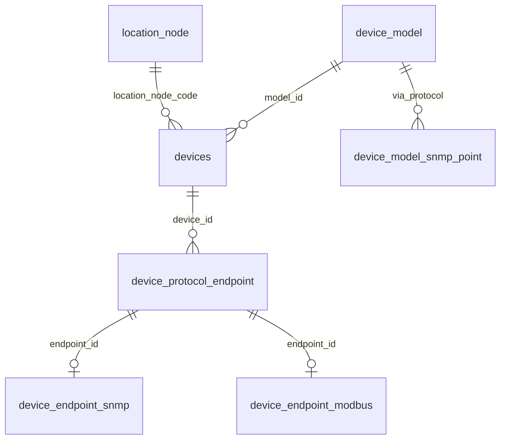
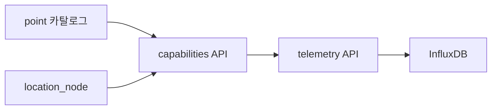
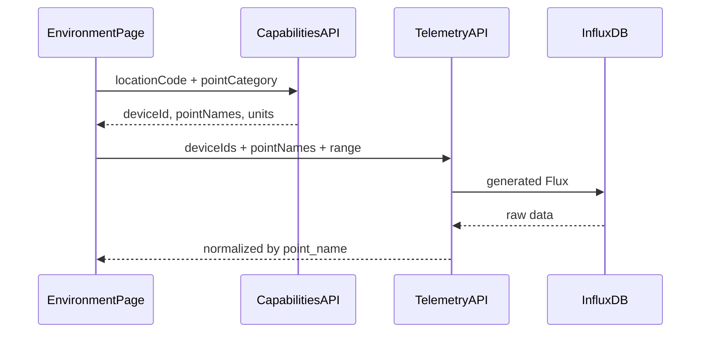

# Device 아키텍처 및 구현 로드맵

`new-manager-server`의 **장비(device) 도메인 전체 설계 방향**을 정리한 문서입니다.  
기존 `manager-server`의 `devices` + `attributes` JSON 구조와 하드코딩 문제를 어떻게 해결할지, 단계별로 무엇을 만들지 담습니다.

> 관련 문서  
> - 1차 API: [DEVICE_API.md](./DEVICE_API.md)  
> - 모델 카탈로그: [DEVICE_MODEL_API.md](../devicemodel/DEVICE_MODEL_API.md)  
> - SNMP Point: [DEVICE_MODEL_SNMP_POINT_API.md](../devicemodel/DEVICE_MODEL_SNMP_POINT_API.md)  
> - 위치 트리: [LOCATION_NODE_API.md](../location/LOCATION_NODE_API.md)  
> - 기존 기능 목록: [FEATURES.md](../FEATURES.md)

---

## 1. 왜 이 설계가 필요한가

### 1.1 기존 구조의 문제

기존 `manager-server`는 `devices` 한 테이블에 공통 정보, 모델 정보, 연결 정보를 섞고, 나머지는 `attributes` JSON에 넣었습니다.

```
devices (한 테이블)
├── name, protocol, model_name, location (문자열) ...
└── attributes JSON
    ├── ip, port, instanceId
    ├── sensorType, pduType
    └── collectionScriptId ...
```

| 문제 | 원인 |
|------|------|
| 컬럼이 계속 늘어남 | 공통/인스턴스/모델 정보가 한곳에 섞임 |
| `attributes` JSON | 스키마 없음 → 검증·조회·인덱스 불가, 키가 장비마다 제각각 |
| `model_name`, `protocol` 중복 | `model_id`와 별도 저장 → 데이터 불일치 |
| `location` VARCHAR | 위치 트리와 무관한 자유 텍스트 |
| Java 코드에 벤더/zone 분기 | 업체·장비 추가마다 코드 수정 필요 |

**장비 종류마다 `devices_pdu`, `devices_sensor` 테이블을 따로 만드는 것도 해답이 아닙니다.** 테이블만 늘고 CRUD·조인·마이그레이션이 반복됩니다.

### 1.2 manager-server 하드코딩 유형 (제거 대상)

변경 빈도가 높은 메타데이터가 Java 코드에 박혀 있어, 업체·벤더 추가 시마다 코드를 수정해야 합니다.

| 유형 | 예시 | 증상 |
|------|------|------|
| 장비/센서 타입 | `SensorService` | `sensorType` switch — case 추가 |
| Influx field | `EnvironmentRepository` | `dragino_data`, `TempC_SHT` 하드코딩 |
| Zone/고객별 API | `EnvironmentController` | `IRC`, `RDCC`, Coupang 전용 API |
| Zone별 응답 DTO | `InRowZoneResponse` 등 | zone마다 전용 record |
| 벤더별 Registry | `CduSnmpTelemetryRegistry` | deviceId 맵에 수동 등록 |
| 상수 클래스 | `PduSensorFieldConstants` | 포인트 추가 시 상수 수정 |
| attributes JSON | `PduDeviceService` | `sensorType`, `ip` 스키마 없음 |
| 현장 땜질 | `buildRack41TempHumOverride()` | 배선 변경마다 코드 패치 |

**개선 원칙:** 하드코딩을 0으로 만들 필요는 없습니다. **자주 바뀌는 것**(벤더, 포인트, zone 구성, Influx 매핑)만 DB 카탈로그로 빼면 됩니다.

---

## 2. 권장 아키텍처 — 4층 분리

SNMP, Modbus, MQTT 모두 **host·port**가 필요합니다. 프로토콜마다 ip/port 컬럼을 중복 저장하지 않고, **엔드포인트 패턴(Class Table Inheritance)** 을 사용합니다.



| 층 | 테이블 | 역할 | 한 줄 설명 |
|----|--------|------|-----------|
| **① 카탈로그** | `device_model`, `device_model_*_point` | 제품군이 **무엇을** 읽는지 | "APC PDU는 전압 OID가 …" |
| **② 인스턴스** | `devices` | 현장 1대 식별 | "Rack-01의 PDU-좌" (미지정=`UNASSIGNED`) |
| **③ 엔드포인트** | `device_protocol_endpoint` | **host, port** (프로토콜 공통) | "192.168.1.10:161" |
| **④ 프로토콜 확장** | `device_endpoint_snmp`, `device_endpoint_modbus` … | SNMP/Modbus 전용 필드 | community, instanceId, unitId |

**핵심 규칙**

- **모델** = "이 제품이 뭔지 + 어떻게 읽는지"
- **장비** = "현장 1대 식별 + 그 1대만 다른 연결값"
- **위치** = `location_node_code` **필수**. 선등록 시 V004 시드 **`UNASSIGNED`**, 이후 실제 Rack/Zone으로 수정
- **UK:** `(device_id, protocol_type_id)` — 장비당 프로토콜 1엔드포인트
- **`devices.attributes` JSON 금지** — 새 요구는 어느 층인지 판단 후 typed 테이블 추가

### 2.1 왜 `device_snmp_config` 단독 테이블은 부족한가

| 문제 | 엔드포인트 패턴 해결 |
|------|---------------------|
| Modbus도 ip/port 필요 | `host`/`port`는 endpoint 공통 |
| 한 장비에 SNMP+Modbus 동시 | endpoint 2행 (같은 host, port 161/502) |
| MQTT broker 추가 | endpoint + `device_endpoint_mqtt` 확장만 추가 |
| 수집기가 "어디로 붙지?" | endpoint 1곳에서 조회 |

### 2.2 2차 스키마 개요 (V009 — 공통 전송층)

> DDL 번호: 문서 초안의 V008은 `device_model.device_type_id` ALTER에 사용됨 → endpoint는 **V009**.  
> API: [DEVICE_ENDPOINT_API.md](./DEVICE_ENDPOINT_API.md)

**`device_protocol_endpoint`** — 공통 전송층 ✅ 구현됨

| 컬럼 | 설명 |
|------|------|
| `device_id` | FK → devices (ON DELETE CASCADE) |
| `protocol_type_id` | FK → common_code (`PROTOCOL_TYPE`) |
| `host`, `port` | IP/hostname, 포트 |
| `enabled` | 사용 여부 |

**UK:** `(device_id, protocol_type_id)` — 장비당 프로토콜 1엔드포인트

검증: `device_model_protocol`에 없는 프로토콜 endpoint 등록 불가.

**`device_endpoint_snmp`** — SNMP 전용 (`endpoint_id` PK FK) — ⬜ 예정

| 컬럼 | 설명 |
|------|------|
| `community`, `version` | SNMP 접속 정보 |
| `instance_id` | OID `{instanceId}` 치환용 |

**`device_endpoint_modbus`** — Modbus 전용 (`endpoint_id` PK FK) — ⬜ 예정

| 컬럼 | 설명 |
|------|------|
| `unit_id`, `timeout_ms` | 슬레이브 ID, 타임아웃 |

현재 API는 Device 자식 리소스(`/devices/{deviceId}/endpoints`) CRUD입니다.  
Device 등록 시 nested `endpoints[]` 일괄 등록은 **이후** (필수는 아님).

참고용 nested body 예시 (향후):

```json
{
  "modelId": 1,
  "name": "PDU-좌",
  "locationNodeCode": "M4n3B2v1C0",
  "endpoints": [{
    "protocolCode": "snmp",
    "host": "192.168.1.10",
    "port": 161,
    "snmp": { "community": "public", "instanceId": null }
  }, {
    "protocolCode": "modbus",
    "host": "192.168.1.10",
    "port": 502,
    "modbus": { "unitId": 1 }
  }]
}
```

---

## 3. attributes JSON → 어디로 가나

`attributes` JSON을 `device_model` 한곳으로 옮기라는 뜻이 **아닙니다.** 역할별로 쪼개서 맞는 테이블에 둡니다.

| 기존 JSON 키 | 새 위치 | 이유 |
|--------------|---------|------|
| `ip`, `port` | `device_protocol_endpoint` | SNMP/Modbus/MQTT 공통 |
| `instanceId`, `community` | `device_endpoint_snmp` | SNMP 전용 |
| `unit_id` | `device_endpoint_modbus` | Modbus 전용 |
| `sensorType`, `pduType` | `device_model` + common_code | 제품군 공통 속성 |
| OID, point 이름 | `device_model_snmp_point` | 이미 분리됨 |
| `collectionScriptId` | `device_collection_script` FK (향후) | 수집 모듈 연동 |

### 기존 컬럼 → 신규 매핑

| 기존 `devices` | 신규 | 비고 |
|----------------|------|------|
| `device_id` varchar | `devices.id` INT | 마이그레이션 시 매핑 검토 |
| `model_id` | `devices.model_id` NOT NULL FK | 필수로 강화 |
| `protocol`, `model_name` | **삭제** | model JOIN으로 조회 |
| `location` varchar | `devices.location_node_code` FK | location_node |
| `path` | **삭제** | location 트리에서 계산 |
| `attributes.*` | 위 표 참고 | JSON 재도입 금지 |
| `parent_device_id` | `devices.parent_device_id` (4차+) | 1차는 플랫 |

---

## 4. 데이터 예시

### 4.1 APC PDU 2대 (Rack-01)

| 테이블 | 내용 |
|--------|------|
| `device_model` | id=1, name=AP8959, manufacturer=APC |
| `device_model_snmp_point` | V, A OID (모든 PDU 공통) |
| `devices` | id=201 PDU-좌, id=202 PDU-우 (같은 model_id, location) |
| `device_protocol_endpoint` | 201→192.168.1.10:161, 202→192.168.1.11:161 |
| `device_endpoint_snmp` | community=public |

> 기존 `attributes.pduType: "phase-3"` → 모델 메타 또는 common_code

**스크립트 생성 (PDU-좌):** point "V" OID + host 192.168.1.10:161

### 4.2 Dragino 온습도 센서 2대 (같은 모델, IP만 다름)

| 테이블 | 내용 |
|--------|------|
| `device_model` | id=2, LHT65N (temp/hum 센서) |
| `devices` | id=301, 302 — 이름만 다름 |
| `device_protocol_endpoint` | 301→14.42.43.207:30262, 302→14.42.43.208:30262 |

> 기존 `sensorType: "temp/hum"` → 모델에 1번만. IP는 장비별 endpoint.

### 4.3 CDU (instanceId 필요)

| 항목 | 값 |
|------|-----|
| 모델 point OID | `1.3.6.1.4.1.12345.{instanceId}.10.1.0` |
| 장비 instance_id | 3 |
| **최종 OID** | `1.3.6.1.4.1.12345.3.10.1.0` |

→ **모델 point 템플릿 + 장비 instance_id** 조합 ([DEVICE_MODEL_SNMP_POINT_API §9](../devicemodel/DEVICE_MODEL_SNMP_POINT_API.md))

### 4.4 기존 vs 신규 (PDU-좌 1대)

| 기존 (1행 + JSON) | 신규 |
|-------------------|------|
| `attributes: {"ip":"192.168.1.10","pduType":"phase-3"}` | host/port → endpoint, pduType → model |
| `location: "Rack-01"` | `location_node_code` FK |
| `model_name: "AP8959"` (중복) | `model_id` JOIN |

---

## 5. 동적 조회 — 하드코딩 제거

Environment, Analysis, Dashboard가 `sensorType`, zone ID, Influx field를 코드에 두지 않도록 **point 카탈로그 + 조회 API 2단계**로 전환합니다.



| manager-server | new-manager-server |
|----------------|-------------------|
| `sensorType == "TEMP/HUM"` | `point_category = ENVIRONMENT` |
| `dragino-sensor` codeKey | `device_model` + capability |
| `TempC_SHT` Influx field | `point.influx_field` (카탈로그) |
| `getInRowZone("IRC")` | `locationNodeCode` + subtree |
| Coupang 전용 API | generic response + site layout |

### 5.1 Point 카탈로그 확장 (V010 예정)

[`device_model_snmp_point`](../devicemodel/DEVICE_MODEL_SNMP_POINT_API.md)에 메타데이터 컬럼 추가. **한 포인트 정의가 수집·조회·UI·분석을 모두 결정.**

| 컬럼 | 용도 | 대체 대상 |
|------|------|-----------|
| `point_category_id` | ENVIRONMENT, POWER, COOLING … | `sensorType` switch |
| `influx_measurement` | `scheduled_collection_data` 등 | `dragino_data` 하드코딩 |
| `influx_field` | `TempC_SHT`, `TOTAL_WT` | Repository field 상수 |
| `display_role` | TEMP, HUM, DOOR_STATUS, POWER_KW | UI 분기 |
| `analysis_enabled` | 분석 페이지 포함 여부 | codeKey 필터 |
| `unit`, `scale` | 표시 단위·환산 | 상수 클래스 |

**POINT_CATEGORY common_code 예:** `ENVIRONMENT`, `POWER`, `COOLING`, `DOOR`, `FLOW`

| point | category | display_role | Environment | Analysis |
|-------|----------|--------------|-------------|----------|
| temp | ENVIRONMENT | TEMP | O | O |
| hum | ENVIRONMENT | HUM | O | O |
| door_status | DOOR | DOOR_STATUS | O | X |
| TOTAL_WT | POWER | POWER_KW | X | O |

→ Dragino든 Raritan이든 `display_role=TEMP`로 UI 렌더.

### 5.2 Capabilities API (3차)

MariaDB JOIN으로 **장비 + 모델 + point + endpoint** 를 한 번에 조회합니다.

```
GET /api/manager/devices/capabilities
  ?locationNodeCode=A1b2C3d4E5
  &includeSubtree=true
  &pointCategory=ENVIRONMENT
  &displayRole=TEMP,HUM
```

**응답 핵심:** deviceId, point names, units, resolved OID, endpoint host:port

Environment 페이지는 zone ID(`IRC`) 대신 **location_node 트리**로 범위 지정. ShowRoom·Coupang 모두 같은 API.

### 5.3 Telemetry Query API (3.5차)

vendor별 Repository(`EnvironmentRepository`, `AnalysisRepository` …)를 **1개 범용 API**로 통합.

```
GET /api/manager/telemetry/last?deviceIds=301,302&pointNames=temp,hum
GET /api/manager/telemetry/chart?deviceIds=301&pointNames=temp&startDate=...&endDate=...
```

**내부 동작:**
1. capabilities에서 influx_measurement, influx_field 조회
2. point catalog 기반 Flux **동적 생성**
3. 응답은 논리 point name 기준 (`temp`, `hum`) — Influx field명 노출 안 함

### 5.4 Analysis API 재설계 (4차)

manager-server의 dragino/pdu 가정 제거:

```
GET /api/manager/analysis/devices?locationNodeCode=...&analysisEnabled=true
GET /api/manager/analysis/chart?deviceIds=301&pointNames=temp,hum&startDate=...
```

- 장비 목록: capabilities + `analysis_enabled=true`
- 차트: telemetry/chart API 재사용
- **벤더·codeKey 분기 없음**

### 5.5 Influx 태그 규약

| tag | 출처 | manager-server 대체 |
|-----|------|---------------------|
| `device_id` | devices.id | `dragino-sensor_deviceId` |
| `point_name` | snmp_point.name | `TempC_SHT` |
| `point_category` | 카탈로그 | 없음 |
| `location_code` | devices.location_node_code | 없음 |
| `model_id` | devices.model_id | 없음 |

### 5.6 페이지별 조회 흐름



| 페이지 | pointCategory | 비고 |
|--------|---------------|------|
| Environment | ENVIRONMENT | temp, hum, door |
| Dashboard Power | POWER | V, A, kW |
| Cooling | COOLING, FLOW | CDU point |

### 5.7 향후 (5~6차, device 외 모듈)

| 기능 | 테이블/모듈 | 목적 |
|------|-------------|------|
| Site/Layout | `site_profile`, `dashboard_layout` | Coupang 전용 API 제거 |
| Display Alias | `device_display_alias` | 현장 땜질(override) 코드 대체 |
| 장비 계층 | `devices.parent_device_id` | Registry 클래스 제거 |
| 수집 스크립트 | `device_collection_script` FK | 수집기 연동 |

---

## 6. 설계 원칙 (반드시 지킬 것)

1. **`devices`에는 인스턴스 공통 필드만** — 프로토콜/벤더 전용 값 금지
2. **host/port → `device_protocol_endpoint`** — SNMP/Modbus/MQTT 공통, 중복 금지
3. **프로토콜 전용 값 → 확장 테이블** — snmp: community/instanceId, modbus: unit_id
4. **수집·조회·UI·분석 메타 → point 카탈로그** — sensorType, Influx field 하드코딩 금지
5. **페이지 조회 → capabilities + telemetry API** — codeKey/sensorType if 금지
6. **고객별 API/DTO 금지** — site layout + generic response
7. **`attributes` JSON 금지** — typed 테이블 + common_code

---

## 7. 구현 로드맵

현재 [DEVICE_API.md](./DEVICE_API.md) + V007은 **② 인스턴스 본체**, [DEVICE_ENDPOINT_API.md](./DEVICE_ENDPOINT_API.md) + V009는 **③ 공통 전송층**, [DEVICE_SNMP_INSTANCE_API.md](./DEVICE_SNMP_INSTANCE_API.md) + V011은 **PDU형 instance**까지 구현.

대기열 전체: [BACKLOG.md](../BACKLOG.md)


| 단계 | 작업 | 산출물 | 상태 |
|------|------|--------|------|
| **1차** | `devices` CRUD — model, location, name, enabled | V007, [DEVICE_API.md](./DEVICE_API.md) | ✅ |
| **2차** | `device_protocol_endpoint` 공통 전송층 CRUD | V009, [DEVICE_ENDPOINT_API.md](./DEVICE_ENDPOINT_API.md) | ✅ (modbus device 확장 제외) |
| **2.1차** | `device_snmp_instance` CRUD (PDU `{instanceId}`) | V011, [DEVICE_SNMP_INSTANCE_API.md](./DEVICE_SNMP_INSTANCE_API.md) | ✅ |
| **2.5차** | point 카탈로그 메타 + SRC `device_snmp_point` + Modbus device | V013 후보, 문서 | ⬜ [BACKLOG Phase 1](../BACKLOG.md) |
| **3차** | `GET /devices/capabilities` | [DEVICE_CAPABILITY_API.md](./DEVICE_CAPABILITY_API.md) | ✅ |
| **3.5차** | 범용 telemetry query API | TELEMETRY_API.md | ⬜ |
| **4차** | analysis API 재설계 | ANALYSIS_API.md | ⬜ |
| **5차** | site layout, display alias | dashboard 모듈 | ⬜ |
| **6차** | parent_device_id, collection_script | **V011 아님** (V011=snmp_instance) | ⬜ |

### 7.1 지금 할 일 (체크리스트)

- [x] 1차: devices 엔티티·Repository·Service·Controller·통합테스트 (V007)
- [x] 2차(공통): device_protocol_endpoint CRUD (V009, DEVICE_ENDPOINT_API.md)
- [x] DeviceModel 삭제 시 devices 참조 409 검증
- [x] 2.1차: device_snmp_instance CRUD (V011)
- [x] 모델 snmp point OID UK (V012)
- [x] **Device ↔ Page 매핑** (어느 화면에 이 장비를 올릴지) — [DEVICE_PAGE_API.md](./DEVICE_PAGE_API.md) / V013
- [ ] SRC형 device_snmp_point — 보류
- [ ] Device Modbus 확장 (unit_id 등)
- [ ] Device 등록 nested `endpoints[]` (선택, 낮음)
- [x] `GET /devices/capabilities` (pageCode + location, SNMP OID 합성) — [DEVICE_CAPABILITY_API.md](./DEVICE_CAPABILITY_API.md)
- [ ] 범용 telemetry / analysis API 설계

> **페이지 배정은 device 단위.** point에 ENVIRONMENT/COOLING을 붙이지 않는다. 구 codeKey·zone ID·analysisYn 하드코딩 대체.

---

## 8. 접근 방식 비교

| 접근 | 장점 | 단점 | 채택 |
|------|------|------|------|
| 종류별 devices 테이블 | 타입별 컬럼 명확 | 테이블·API N배 | **비권장** |
| 단일 devices + JSON | 추가 테이블 없음 | 기존과 동일한 혼란 | **비권장** |
| 단일 devices + endpoint + 확장 | host/port 공통, typed 확장 | DDL·JOIN 증가 | **권장** |
| EAV (key-value) | 무한 확장 | JSON과 유사한 문제 | **비권장** |

**"같은 종류 device끼리 묶어서 관리"** → **`device_model`로 묶습니다.**  
같은 APC PDU 20대는 같은 `model_id`를 쓰고, 인스턴스마다 다른 것(host, instanceId)만 endpoint + 확장 테이블에 둡니다.

---

## 9. 요약

**업체마다 Java를 수정하는 이유는 "무엇을 읽고, 어디에 붙고, 어떻게 보여줄지"가 코드에 있기 때문입니다.**

`device_model` point 카탈로그에 이 3가지를 모으고, environment/analysis는 **capabilities → telemetry** 2단계 API만 호출하면, 신규 벤더·고객은 **데이터 등록**으로 대응할 수 있습니다.

```
장비 종류별 테이블 ❌
→ device_model로 제품군 묶기 ✅
→ devices는 얇게 ✅
→ host/port는 endpoint 공통 ✅
→ SNMP/Modbus 전용 값은 확장 테이블 ✅
→ Environment/Analysis는 point_category + capabilities API ✅
```
