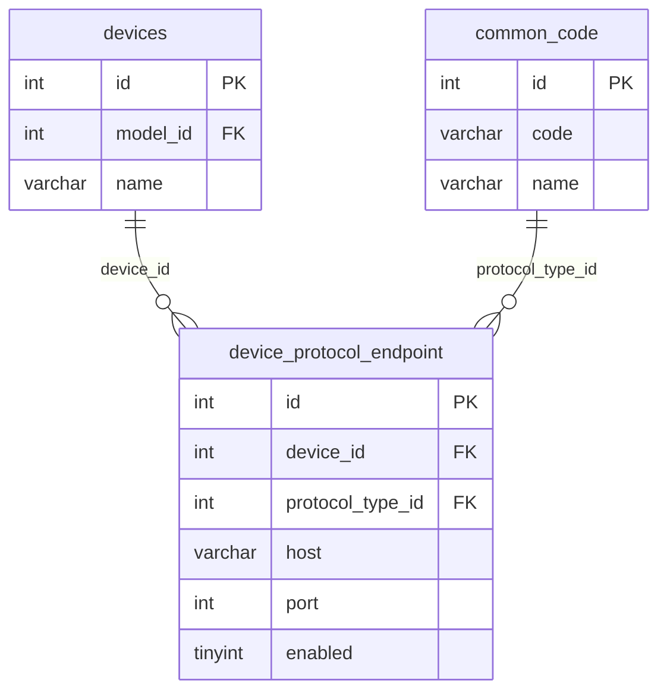

# Device Protocol Endpoint API 설계

`device` 모듈의 **프로토콜 엔드포인트**(`device_protocol_endpoint`) API·비즈니스 규칙을 정리한 문서입니다.

> API prefix: `/api/manager/devices/{deviceId}/endpoints`  
> 아키텍처: [DEVICE_ARCHITECTURE.md](./DEVICE_ARCHITECTURE.md) §2.2  
> 부모 API: [DEVICE_API.md](./DEVICE_API.md)  
> 관련 ERD: [ERD.md — device_protocol_endpoint](../ERD.md#device_protocol_endpoint--프로토콜-엔드포인트-공통-전송층)  
> DDL: [V009__create_device_protocol_endpoint.sql](../../sql/history/V009__create_device_protocol_endpoint.sql)

---

## 1. 개요

| 개념 | 설명 |
|------|------|
| **Device** | 현장 장비 인스턴스 1대 |
| **DeviceProtocolEndpoint** | 장비의 **host/port** (프로토콜 공통 전송층). SNMP/Modbus/MQTT가 공유 |
| **PROTOCOL_TYPE** | `common_code` 그룹. 모델이 지원하는 프로토콜만 endpoint 등록 가능 |

SNMP·Modbus·MQTT 모두 목적지 주소(host, port)가 필요합니다. 프로토콜마다 ip/port를 중복하지 않고 **공통 테이블**에 둡니다.

| 층 | 테이블 | 역할 | 본 문서 |
|----|--------|------|---------|
| ② 인스턴스 | `devices` | 현장 1대 식별 | [DEVICE_API](./DEVICE_API.md) |
| ③ 엔드포인트 | `device_protocol_endpoint` | host, port | **본 문서 (구현됨)** |
| ④ 확장 | `device_snmp_instance` 등 | instanceId, unit_id … | [DEVICE_SNMP_INSTANCE_API](./DEVICE_SNMP_INSTANCE_API.md) 등 |

### 1.1 이번 범위

| 포함 | 미포함 (이후) |
|------|----------------|
| `device_protocol_endpoint` CRUD | `device_snmp_point` (SRC형 OID) |
| Device 자식 리소스 API | Device `POST`/`PUT` nested `endpoints[]` |
| host/port/enabled | community/version DB 저장 |
| | [DEVICE_SNMP_INSTANCE_API](./DEVICE_SNMP_INSTANCE_API.md) — ⬜ 예정 |

endpoint는 Device 등록 시 **필수가 아닙니다.** 장비만 먼저 등록하고 나중에 endpoint를 붙일 수 있습니다. (location의 `UNASSIGNED`와 같은 선등록 패턴)

### 1.2 공통 제약

| 항목 | 규칙 |
|------|------|
| `deviceId` | 필수. 존재하는 `devices.id` |
| `protocolTypeId` | 필수. `PROTOCOL_TYPE` common_code만 |
| 모델 지원 | 해당 device의 model이 `device_model_protocol`에 그 프로토콜을 가져야 함 |
| UK | `(device_id, protocol_type_id)` — 장비당 프로토콜 1엔드포인트 |
| UK | `(host, port)` — 수집 목적지 중복 불가 |
| `host` | 필수. 비어 있지 않은 문자열 (IP 또는 hostname). **형식 정규식 검증은 하지 않음** |
| `port` | 필수. 1~65535 |
| `enabled` | boolean. 기본 `true` |
| Device 삭제 | endpoint **CASCADE** (자식이므로 409 아님) |

---

## 2. 테이블 — `device_protocol_endpoint`

**구현 상태:** ✅ 구현됨

| 컬럼 | 타입 | NULL | 키 | 기본값 | 설명 |
|------|------|------|-----|--------|------|
| `id` | INT | N | PK | AUTO_INCREMENT | 엔드포인트 ID |
| `device_id` | INT | N | FK, UK | | `devices.id` |
| `protocol_type_id` | INT | N | FK, UK | | `common_code.id` (`PROTOCOL_TYPE`) |
| `host` | VARCHAR(255) | N | | | IP 또는 hostname |
| `port` | INT | N | | | 포트 (CHECK 1~65535) |
| `enabled` | TINYINT(1) | N | | `1` | 사용 여부 |
| `created_dt` | TIMESTAMP(6) | Y | | | |
| `updated_dt` | TIMESTAMP(6) | Y | | | |

**UK:** `(device_id, protocol_type_id)`, `(host, port)`

**FK 제약**

| FK | 참조 | ON DELETE | ON UPDATE |
|----|------|-----------|-----------|
| `fk_device_protocol_endpoint_device_id` | `devices(id)` | **CASCADE** | CASCADE |
| `fk_device_protocol_endpoint_protocol_type_id` | `common_code(id)` | RESTRICT | CASCADE |

**관계도**



---

## 3. 등록 API

### 3.1 등록 — `POST /api/manager/devices/{deviceId}/endpoints`

**구현 상태:** ✅ 구현됨

#### 요청

```json
{
  "protocolTypeId": 7,
  "host": "192.168.1.10",
  "port": 161,
  "enabled": true
}
```

| 필드 | 필수 | 설명 |
|------|------|------|
| `protocolTypeId` | O | `PROTOCOL_TYPE` common_code ID |
| `host` | O | IP 또는 hostname |
| `port` | O | 1~65535 |
| `enabled` | X | 기본 `true` |

#### 응답 — `200 OK`

```json
{
  "success": true,
  "data": {
    "id": 1,
    "deviceId": 101,
    "protocolTypeId": 7,
    "protocolCode": "snmp",
    "protocolName": "SNMP",
    "host": "192.168.1.10",
    "port": 161,
    "enabled": true
  }
}
```

| 조건 | HTTP | 메시지(예) |
|------|------|------------|
| device 없음 | 404 | `Device not found: {deviceId}` |
| protocolType 없음 | 404 | `CommonCode not found: {id}` |
| PROTOCOL_TYPE 아님 | 400 | `protocolType must belong to PROTOCOL_TYPE group` |
| 모델 미지원 프로토콜 | 400 | `protocol not supported by device model` |
| UK 중복 (장비+프로토콜) | 409 | `endpoint already exists for this protocol` |
| UK 중복 (host+port) | 409 | `endpoint already exists for this host and port` |
| host 공백 / port 범위 | 400 | Bean validation 메시지 |

---

## 4. 수정 API

### 4.1 수정 — `PUT /api/manager/devices/{deviceId}/endpoints/{endpointId}`

**구현 상태:** ✅ 구현됨

요청 body는 등록과 동일하며 **전체 교체**입니다.

| 조건 | HTTP | 메시지(예) |
|------|------|------------|
| device 없음 | 404 | `Device not found: {deviceId}` |
| endpoint 없음(또는 다른 device) | 404 | `DeviceProtocolEndpoint not found: {endpointId}` |
| 모델 미지원 / PROTOCOL_TYPE 아님 | 400 | (등록과 동일) |
| 다른 endpoint와 protocol 중복 | 409 | `endpoint already exists for this protocol` |
| 다른 endpoint와 host+port 중복 | 409 | `endpoint already exists for this host and port` |

---

## 5. 조회 API

### 5.1 목록 — `GET /api/manager/devices/{deviceId}/endpoints`

**구현 상태:** ✅ 구현됨

해당 장비의 endpoint를 **id 오름차순**으로 반환합니다. 없으면 `[]`.

| 조건 | HTTP | 메시지(예) |
|------|------|------------|
| device 없음 | 404 | `Device not found: {deviceId}` |

### 5.2 단건 — `GET /api/manager/devices/{deviceId}/endpoints/{endpointId}`

**구현 상태:** ✅ 구현됨

목록 항목 1건과 동일 구조.

| 조건 | HTTP | 메시지(예) |
|------|------|------------|
| device 없음 | 404 | `Device not found: {deviceId}` |
| endpoint 없음 | 404 | `DeviceProtocolEndpoint not found: {endpointId}` |

---

## 6. 삭제 API

### 6.1 삭제 — `DELETE /api/manager/devices/{deviceId}/endpoints/{endpointId}`

**구현 상태:** ✅ 구현됨

| 조건 | HTTP | 동작 |
|------|------|------|
| 존재 | 200 | 삭제, 삭제된 `id` 반환 |
| device 없음 | 404 | `Device not found: {deviceId}` |
| endpoint 없음 | 404 | `DeviceProtocolEndpoint not found: {endpointId}` |

#### 응답 — `200 OK`

```json
{
  "success": true,
  "data": 1
}
```

---

## 7. API 요약

| Method | Path | 설명 | 상태 |
|--------|------|------|------|
| `GET` | `/api/manager/devices/{deviceId}/endpoints` | 목록 | ✅ |
| `GET` | `/api/manager/devices/{deviceId}/endpoints/{endpointId}` | 단건 | ✅ |
| `POST` | `/api/manager/devices/{deviceId}/endpoints` | 등록 | ✅ |
| `PUT` | `/api/manager/devices/{deviceId}/endpoints/{endpointId}` | 수정 | ✅ |
| `DELETE` | `/api/manager/devices/{deviceId}/endpoints/{endpointId}` | 삭제 | ✅ |

---

## 8. 구현 현황

| 구분 | 내용 |
|------|------|
| 문서 | 본 문서 |
| DDL | V009 ✅ / V015 `(host, port)` UK ✅ |
| 도메인 | `DeviceProtocolEndpoint` ✅ |
| Application | `DeviceProtocolEndpointQueryService` CRUD ✅ |
| API | 목록·단건·등록·수정·삭제 ✅ |
| 확장 테이블 | snmp/modbus/mqtt — 미구현 |
| Device nested body | — 미구현 (선택 기능, 이후) |

---

## 9. 갱신 이력

| 날짜 | 변경 |
|------|------|
| 2026-07-23 | 최초 작성 — 공통 전송층 CRUD·V009 (확장 테이블 제외) |
| 2026-08-18 | `(host, port)` 중복 방지 (V015, 409) |
